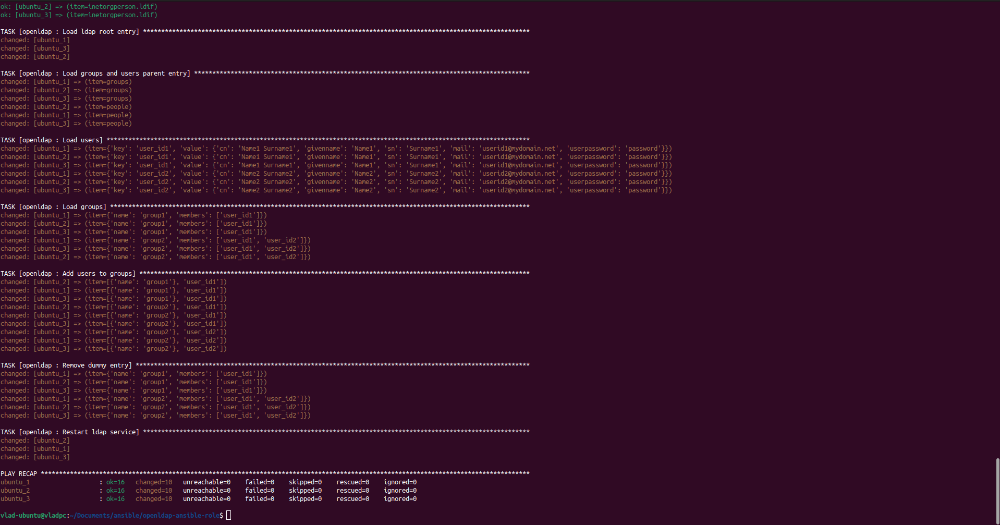

## написать ansible скрипт реализующий следующее:
1. на ОС ubuntu LTS установить openldap сервер
2. установить в ldap пароль администратора
3. установить в ldap domain и organization
4. добавить 2 пользователя в ldap
6. добавить 2 группы в ldap

### Для тестового стенда мной был выбран Docker контейнер ubuntu 22.04 LTS.
### Для проверки работы скрипта будут полезны следующие команды

Docker:

`sudo docker build -t ssh_image_test .` - команда для сборки контейнера ssh_image_test из Dockerfile

`sudo docker run -d --rm -p 50022:22 ssh_image_test` - команда для запуска контейнера ключ -d указывает на то что контейнер запущен в фоновом режиме, ключ --rm удалить после остановки контейнера, ключ -p порт.

`ssh -p 50022 test@127.0.0.1` - команда для подключения по ssh к нашему контейнеру, на самом деле не лучшая практика лучше использовать exec но это только для теста ansible

`'test:testpassw123'` - логин пароль для входа в docker ubuntu по ssh

`ssh-copy-id -p 50022 test@127.0.0.1`- команда для отправки публичного ключа на тестовый стенд, чтобы не вводить пароль при каждом подключении. ssh-keygen - чтобы создать ключ.

Ansible:

`ansible all -i hosts -m ping` - команда для проверки доступности удаленного хоста ключ -i путь до файла hosts.

`ansible-playbook -i hosts playbook.yml --ask-become-pass` - команда для запуска плейбука

- <b>На данном скриншоте показано что все комады отрабатывают без ошибок<b> 
  
  
